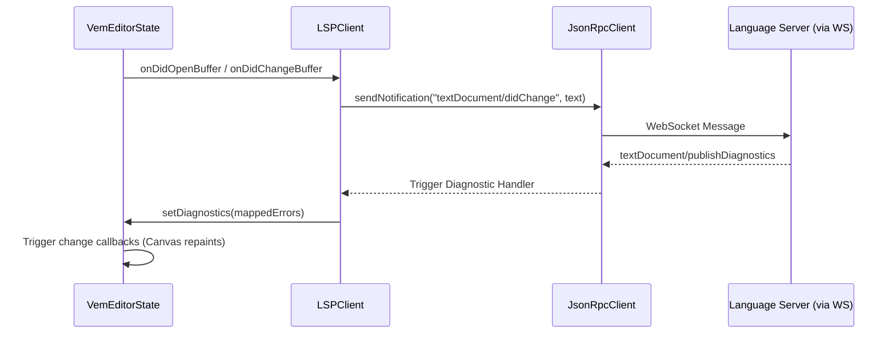

# @vemjs/lsp-client

[](https://www.npmjs.com/package/@vemjs/lsp-client)
[](LICENSE)

A lightweight Language Server Protocol (LSP) client and JSON-RPC 2.0 communication engine for the **Vem Editor**. It establishes connection to language servers over WebSocket connections, synchronizes document buffers dynamically, and maps incoming diagnostics or completion results straight to the editor state.

## Features

- **JSON-RPC 2.0 Protocol Engine**: Direct implementation of the JSON-RPC 2.0 spec over WebSockets, including automatic correlation of request/response IDs and fire-and-forget notifications.
- **Document Synchronization**: Binds directly to `@vemjs/core` editor buffers, automatically sending `textDocument/didOpen`, `textDocument/didChange`, and `textDocument/didClose` notification events on text edit triggers.
- **AutoComplete Bridge**: Fetch completions asynchronously on demand and dispatch them to listeners.
- **Hover Capability**: Query type signatures or docs from language servers under current editor positions.
- **Diagnostics Translation**: Subscribes to `textDocument/publishDiagnostics` notifications, translates severity mappings, and automatically updates `@vemjs/core` diagnostics storage.

## Installation

```bash
bun add @vemjs/lsp-client
# or via npm
npm install @vemjs/lsp-client
```

## Quick Start

Initialize the LSP client, attach it to the editor state, and connect:

```typescript
import { VemEditorState } from '@vemjs/core';
import { LSPClient } from '@vemjs/lsp-client';

const editorState = new VemEditorState('const a = 123;');
const lsp = new LSPClient('ws://localhost:8080', 'file:///workspace/app.ts', 'typescript');

// Attach before connecting to auto-bind didOpen / didChange buffer events
await lsp.connect(editorState);

// Request completions at line 0, character 12
const completions = await lsp.requestCompletion(0, 12);
console.log('Completions:', completions);
```

## API Reference

### `JsonRpcClient`

Low-level client for communication.

- `constructor(url: string)`: Creates a new JSON-RPC client.
- `connect(): Promise<void>`: Connects to the WebSocket URL.
- `disconnect(): void`: Closes the WebSocket connection.
- `isConnected: boolean`: Get connection status.
- `sendRequest(method: string, params?: unknown): Promise<unknown>`: Sends a request with generated unique ID and awaits the server's reply.
- `sendNotification(method: string, params?: unknown): void`: Sends a notification without expecting a response.
- `onNotification(method: string, cb: (params: unknown) => void): void`: Registers a handler for server notifications.

### `LSPClient`

High-level LSP integration wrapper.

- `constructor(serverUrl: string, fileUri: string, languageId: string)`: Creates an LSPClient instance.
- `connect(editorState?: VemEditorState): Promise<void>`: Initiates WebSocket connection, attaches optional editor state, and performs the standard LSP `initialize` / `initialized` handshake.
- `disconnect(): void`: Sends LSP `exit` notification and disconnects.
- `attach(editorState: VemEditorState): void`: Binds to editor buffer change events to automate buffer sync.
- `requestCompletion(line: number, character: number): Promise<LspCompletionItem[]>`: Queries the server for autocomplete options at the specified coordinates.
- `requestHover(line: number, character: number): Promise<string | null>`: Queries type details or docs at the position.
- `sendDidClose(): void`: Sends standard document close notification to free server resources.
- `onCompletion(cb: (items: LspCompletionItem[]) => void): void`: Register autocomplete event listener.
- `onHover(cb: (content: string) => void): void`: Register hover event listener.
- `setFileUri(uri: string): void`: Switches file URI context.
- `setLanguageId(id: string): void`: Switches language context.

---

## Connecting to TypeScript Language Server

To run a language server in the browser environment, you can proxy `typescript-language-server` or `typescript-language-server --stdio` through a simple WebSocket proxy (such as `ws-jsonrpc-proxy` or standard stdio-to-ws bridges).

Here is a complete setup workflow:

```typescript
import { VemEditorState } from '@vemjs/core';
import { LSPClient } from '@vemjs/lsp-client';

const editor = new VemEditorState('console.l');

// Establish LSPClient connection to the proxy URL
const lsp = new LSPClient('ws://localhost:2087', 'file:///mnt/workspace/index.ts', 'typescript');

// Register autocomplete handler
lsp.onCompletion((items) => {
  console.log('Received completions:');
  items.forEach((item) => {
    console.log(`- ${item.label} (${item.detail ?? 'no detail'})`);
  });
});

await lsp.connect(editor);

// Send keys to append characters to trigger didChange
editor.input('o'); // buffer now contains: console.lo
editor.input('g'); // buffer now contains: console.log

// Ask for completion at line 0, position 11 (after 'log')
const results = await lsp.requestCompletion(0, 11);
```

## Architecture



## Contributing

Please review [CONTRIBUTING.md](../../CONTRIBUTING.md) for details on our workflow and engineering guidelines.

## License

This package is licensed under the MIT License - see the LICENSE file for details.
