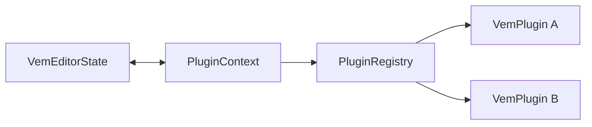

# @vemjs/plugin-api

[](https://www.npmjs.com/package/@vemjs/plugin-api)
[](LICENSE)

The official Plugin SDK and life-cycle registration layer for the **Vem Editor**. It allows third-party developers to register custom keybindings, hook into buffer updates, intercept mode transitions, and build complex chords or commands.

## Features

- **Standardized Plugin Interface**: Clean activation/deactivation lifecycles matching the `@vemjs/core` environment.
- **Keybinding Registration**: Dynamically override editor shortcuts or register command chords in specific modes.
- **Event Observers**: Hook into buffer creation (`onDidOpenBuffer`), text mutations (`onDidChangeBuffer`), and mode changes (`onDidChangeMode`).
- **Command Management**: Define global editor commands that can be invoked via the Command Bar or mapped to shortcuts.

## Installation

```bash
bun add @vemjs/plugin-api
# or via npm
npm install @vemjs/plugin-api
```

## Quick Start

Create and activate a plugin that adds a custom keystroke in NORMAL mode:

```typescript
import { VemEditorState } from '@vemjs/core';
import { PluginRegistry, type VemPlugin } from '@vemjs/plugin-api';

const editor = new VemEditorState('initial text');
const registry = new PluginRegistry(editor);

// Define a plugin
const myPlugin: VemPlugin = {
  name: 'my-custom-shortcuts',
  version: '1.0.0',
  activate(context) {
    // Register a command
    context.registerCommand('custom.hello', () => {
      console.log('Hello from command!');
    });

    // Bind keys (e.g. pressing 'gh' in NORMAL mode fires command)
    context.registerKeybinding('NORMAL', 'gh', 'custom.hello');
  },
};

// Register & Activate
registry.register(myPlugin);

// Pressing keys in sequence triggers the command
editor.input('g');
editor.input('h'); // Console prints: "Hello from command!"
```

## API Reference

### `VemPlugin`

Interface representing a loadable plugin.

- `name: string`: Unique package identifier.
- `version: string`: Semantic version string.
- `activate(context: PluginContext): void`: Called by the engine when loading the plugin.
- `deactivate?(): void`: Optional cleanup callback.

### `PluginContext`

Provided to `activate(context)` to interact with the editor.

- `editorState: VemEditorState`: Access to core editor properties.
- `registerCommand(commandName: string, callback: () => void): void`: Registers a function callback globally.
- `registerKeybinding(mode: EditorMode, keys: string, commandName: string): void`: Binds a specific key combination (or chord prefix) in the specified mode to a registered command.
- `onDidOpenBuffer(cb: () => void): void`: Subscribes to buffer open events.
- `onDidChangeBuffer(cb: () => void): void`: Subscribes to buffer content mutation events.
- `onDidChangeMode(cb: (mode: EditorMode) => void): void`: Subscribes to mode change notifications.

### `PluginRegistry`

Manager executing plugin installation.

- `constructor(editorState: VemEditorState)`: Creates the registry bound to an editor instance.
- `register(plugin: VemPlugin): void`: Registers context callbacks and triggers the plugin's `activate` method.
- `executeCommand(name: string): void`: Runs the callback associated with a command.

---

## Plugin Development Guide

### Naming Conventions

For consistency in the ecosystem, plugins should be named using the prefix `vem-plugin-` when published as standalone packages, or `@vemjs/plugin-<name>` if they are officially maintained packages:

- Third-party: `vem-plugin-format-on-save`
- Official: `@vemjs/plugin-treesitter`

### Complete Example: Format-on-Save

Here is a full plugin implementation that automatically trims trailing whitespace whenever a buffer changes (an automated linter/formatter behavior):

```typescript
import { type VemPlugin } from '@vemjs/plugin-api';

export const FormatOnSavePlugin: VemPlugin = {
  name: 'format-on-save',
  version: '1.0.0',
  activate(context) {
    let isFormatting = false;

    context.onDidChangeBuffer(() => {
      // Avoid recursive change loops
      if (isFormatting) return;

      const editor = context.editorState;
      const originalText = editor.getText();
      const lines = originalText.split('\n');

      // Trim trailing spaces
      const formattedLines = lines.map((line) => line.trimEnd());
      const formattedText = formattedLines.join('\n');

      if (formattedText !== originalText) {
        isFormatting = true;
        // Access buffer to set raw text
        editor.getBuffer().setText(formattedText);
        isFormatting = false;
        console.log('[FormatOnSave] Trimmed trailing whitespaces');
      }
    });
  },
};
```

## Architecture



## Contributing

Please review [CONTRIBUTING.md](../../CONTRIBUTING.md) for details on our workflow and engineering guidelines.

## License

This package is licensed under the MIT License - see the LICENSE file for details.
