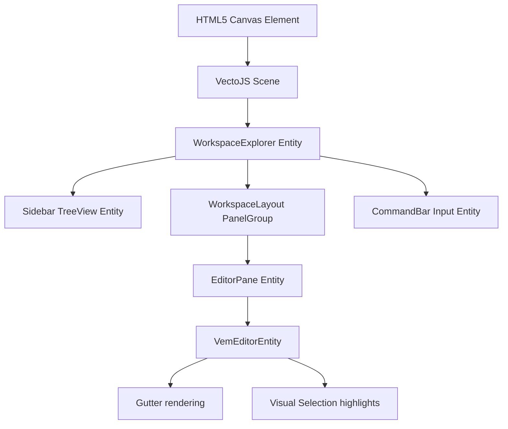

# @vemjs/renderer-vecto

[](https://www.npmjs.com/package/@vemjs/renderer-vecto)
[](LICENSE)

The high-performance, **zero-DOM Canvas 2D** rendering layer for the **Vem Editor**, powered by the [VectoJS](https://github.com/vectojs/vectojs) Entity-Component-System (ECS) engine. It provides the full visual editor layout, including multi-pane split windows, file explorers, tab bars, gutters, line numbers, visual highlights, and the interactive Command Bar.

## Features

- **Zero-DOM Rendering Core**: Every pixel — from individual code glyphs and blinking cursors to selection highlights and sidebar files — is drawn directly to a single HTML5 `<canvas>` via VectoJS ECS entities.
- **Split Windows Layout**: Integrated `WorkspaceLayout` that provides dynamic, resizable vertical and horizontal panels without layout thrashing.
- **Lazy File Explorer Tree**: High-performance sidebar tree component with lazy node expansion leveraging the Web File System Access API.
- **Command Bar Component**: Smooth command-line overlay supporting Vim command history and interactive autocomplete suggestions.
- **Keyboard Event Router**: Advanced physical key event capturing and routing that bypasses browser-native DOM inputs to support Vim normal, insert, visual, and command modes natively.

## Installation

This package requires `@vemjs/core` and `@vectojs/core` as peer dependencies.

```bash
bun add @vemjs/renderer-vecto @vemjs/core @vectojs/core
# or via npm
npm install @vemjs/renderer-vecto @vemjs/core @vectojs/core
```

## Quick Start

Initialize the renderer within a VectoJS Scene, mount the editor shell, and attach a canvas element:

```typescript
import { VemEditorState } from '@vemjs/core';
import { WorkspaceExplorer, VectoRenderer } from '@vemjs/renderer-vecto';
import { Scene } from '@vectojs/core';

// 1. Create Core Editor State
const editorState = new VemEditorState('// Press :w to write, :q to quit\nconsole.log("Vem");');

// 2. Initialize VectoJS Scene on an HTML5 canvas
const canvas = document.querySelector('canvas') as HTMLCanvasElement;
const scene = new Scene(canvas);

// 3. Instantiate the high-level Workspace Explorer layout
const explorer = new WorkspaceExplorer(editorState);

// 4. Add the explorer entity to the VectoJS Scene hierarchy
scene.add(explorer);

// 5. Start the render loop
scene.start();

// 6. Connect high-level keystroke router
canvas.focus();
canvas.addEventListener('keydown', (e) => {
  // Let Vem handle Vim key mappings natively
  explorer.handleKeyEvent(e);
});
```

## API Reference

### `VectoRenderer`

Lower-level binding utility to attach editor states to canvas render cycles.

- `constructor(editorState: VemEditorState)`: Binds editor state context.
- `attach(canvas: HTMLCanvasElement): void`: Instantiates a VectoJS scene, adds a `VemEditorEntity`, and begins the execution loop.
- `render(): void`: Triggers manual state evaluation and update.

### `WorkspaceExplorer`

High-level workspace GUI structure containing the sidebar explorer, file tree picker, and the active editor workspaces.

- `constructor(editorState: VemEditorState)`: Creates the layout hierarchy.
- `getWorkspace(): VemWorkspace`: Returns the active editor workspace tab group.
- `handleKeyEvent(e: KeyboardEvent): void`: Translates and routes physical keyboard events into the modal state machine.

### `VemEditorEntity`

The individual text editing Canvas entity. Handles rendering lines of code, cursors, line selections, and relative gutters. Inherits from `Vecto.Entity`.

---

## VectoJS Zero-DOM Philosophy

Traditional web text editors (e.g. Monaco, VS Code, CodeMirror) rely heavily on absolute-positioned HTML elements or inline `<span>` tags. When rendering large files with complex syntax tokenization, this causes heavy layout thrashing, DOM node pollution, and GC overhead.

Vem rejects this overhead. Under our **Zero-DOM Canvas 2D Philosophy**:

1. **ECS-Driven Rendering**: Every visual piece is a VectoJS `Entity`. Layout is computed on raw float coordinates in memory.
2. **Text Caching**: Font glyphs are cached or drawn using fast sub-pixel Canvas text routines, allowing rendering speeds exceeding 60 FPS even with 10,000 lines of code.
3. **Zero HTML/CSS pollution**: Outside of the single `<canvas>` container, no extra DOM elements are spawned. Gutters, selections, and menus are purely drawn visually.
4. **Portability**: Because the renderer is decoupled from browser-native DOM nodes, Vem can run seamlessly inside Node.js, Web Workers, or Native Tauri containers without changing any styling systems.

## Architecture



## Contributing

Please review [CONTRIBUTING.md](../../CONTRIBUTING.md) for details on our workflow and engineering guidelines.

## License

This package is licensed under the MIT License - see the LICENSE file for details.
